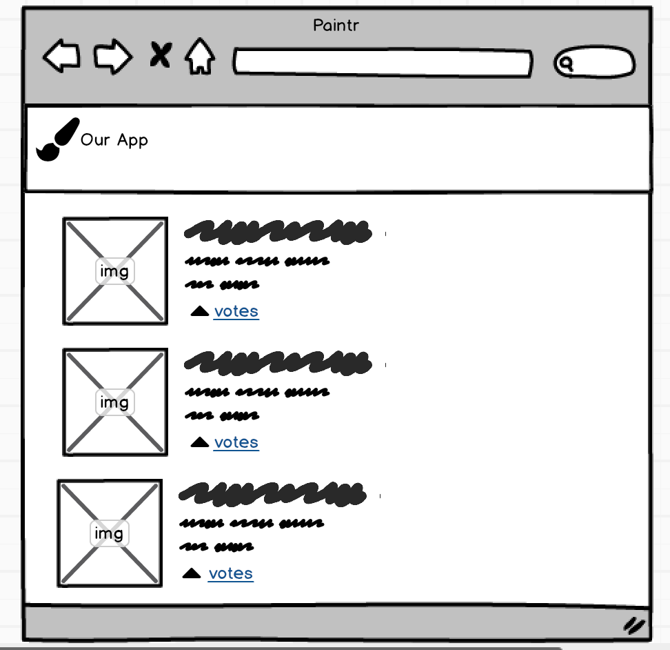
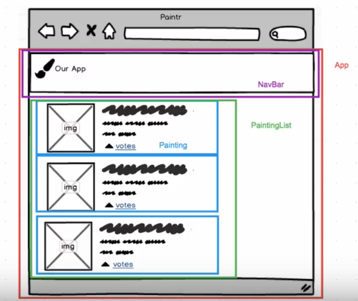

# React-Props-Components

## SWBATs

* Learn how to identify components on a page, visually
* Understand how create-react-app works and what it offers a developer
* Get more familiarity with component hierarchy and the flow of information
    * Learn props 

## Resources

* [Example Video](http://youtu.be/Sjla00Wrj20) - old video(before flipping)

## Outline

    10m Identify Components
    10m create-react-app
    20m Passing Props
     5m CFU: Solidfying props
    10m Class component
     5m Difference between Class Component and functional component
    ===
    60m Total

### Identify Components

When building React Apps I think it's super helpful to wireframe out what you are building and start identifying what is a component. I use [a web whiteboard](https://www.awwapp.com) to draw different colored squares around what will be a component in these pre-made images (made with free trial of balsamic that i took screenshots of). I'll show the first image and have students start identifying what they think is a component.




In this app we'll use the JSON data in src/painting_data.js to mimic data we'd be getting from an API. For the moment, advice to ignore the 'votes' part.

Talk about why you might need a PaintingList Component, single responsibility, it's job is to receive some data and render out individual Painting components (or PaintingItem or PaintingCard or whatever you want to call it).

### create-react-app

Show how `create-react-app` works

* `npm install -g create-react-app` (if they haven't)
* `create-react-app my-app` cd into it.
* `npm install --save semantic-ui-css` talk about what the --save does (adds to package.json, why do we care, etc.)
* _Get rid of everything in c-r-a that we don't know what it is. Service workers, css, tests... delete it all_
* Build out static version of the app with right component structure. (bring in Navbar component from previous lecture) Mention that often in React there's like a certain minimum amount of boilerplate needed to be written to get your app up and rendering. I would make components such as

**Note: With new version of react there is no need to import react package in functional components**

```js

const PaintingList = () => {
  return <div>PaintingList</div>;
};

export default PaintingList;
```

so you can see things rendering correctly on page. Reminder that these are _just functions_. A bit different than class-based components seen in labs, but very very similar and all we have seen in lecture thus far. (Students will continue to have confusion over functional components though I show them every lecture, a deficiency in the curriculum?)

### Passing Props

In a top level component like App import the json data from painting_data and show that you can console.log it (in render) and have access to it. Ask the question of how you are going to get this data to the other components that need to know about it?

The answer, via props. _There is one way to pass data from one component to another in React, that is props. They go one direction, down from parent to child. In lecture 1, we passed props as arguments to a function. Even when using JSX that's really how you should think of props._ **Props are like arguments to a function. A component does not own it's own props they are passed to it from outside.** This is in contrast to state which we'll talk about next.

Pass the props from App to PaintingList and console.log them again. Now you are in a situation where you have an array of plain JS objects. What you want back is an array of the same number of elements, but each element should be a React component. What function does that sound like? `map`! We'll use `map` here for the same reason we would use map to take an array of numbers and double each number.

```js
// ====================================
// Step 1
// PaintingList.js
// see the same number of things we should expect

const PaintingList = (props) => {

  return (
    <div>
    {props.paintings.map(painting => <li>hi</li>)}
    </div>
  )
}

export default PaintingList

// ====================================
// Step 2
// PaintingList.js
// render Painting Components
import Painting from './Painting'

const PaintingList = (props) => {

  return (
    <div>
    {props.paintings.map(painting => <Painting />)}
    </div>
  )
}

export default PaintingList

//Painting.js

const Painting = (props) => {
  return <div>Painting Component</div>
}

export default Painting

// ====================================
// Step 3
// show the titles
import Painting from './Painting'

const PaintingList = (props) => {

  return (
    <div>
    {props.paintings.map(painting => <Painting title={painting.title}/>)}
    </div>
  )
}

export default PaintingList

//Painting.js

const Painting = (props) => {
  return <div>{props.title}</div>
}

export default Painting

// ====================================
// Step 4
// fill out Painting Component
// maybe discuss why it's nicer to pass a prop 'painting'
// vs. a title prop, image prop, artist name prop, dimension prop, etc.
import Painting from './Painting'

const PaintingList = (props) => {

  return (
    <div>
    {props.paintings.map(painting => <Painting painting={painting}/>)}
    </div>
  )
}

export default PaintingList

//Painting.js

const Painting = (props) => {
  return (
    <div>
      
      <h4>
        "{props.painting.title}" by {props.painting.artist.name}
      </h4>
      <p>Year: {props.painting.date}</p>
      <p>
        Dimensions: {props.painting.dimensions.width} in. x {props.painting.dimensions.height} in.
      </p>
    </div>
  )
}

export default Painting
```

Cover the whole flow again, how props get passed down multiple levels, get mapped over, etc. Briefly talk about the `key` prop warning. Basically it's for React's internal workings so it can quickly know what components to update when it's doing that thing of updating the real DOM to look like the virtual DOM

If you want to make the Painting Component look fancy here's some markup: (_NOTE: this also adds the vote button we will use later_)

```js
<div className="item">
  <div className="ui small image">
    
  </div>
  <div className="middle aligned content">
    <div className="header">{`"${props.painting.title}" by ${
      props.painting.artist.name
    }`}</div>
    <div className="description">
      <a>
        <i className="large caret up icon" />
        {props.painting.votes} votes
      </a>
    </div>
  </div>
</div>
```

### CFU: Solidfying props

Ask students to create component for NavBar(see following question) and pass color="red", title="Paintr", icon="paint brush", and description="an app we made" as props from app component.

**Note: make sure to import `semantic-ui-css/semantic.min.css` package in app component for styling.=**

Question:

```js
 const NavBar = props => {
  return (
    <div className={"ui inverted red menu"}>
      <a className="item">
        <h2 className="ui header">
          <i className={"paint brush icon"} />
          <div className="content">Paintr</div>
          <div className="sub header">an app we made</div>
        </h2>
      </a>
    </div>
  );
};

export default NavBar;
```

```js
//App.js

import 'semantic-ui-css/semantic.min.css';
import NavBar from './NavBar';
import PaintingsList from './PaintingsList';
import paintings from './painting_data'


function App() {
  return (
    <div>
      <NavBar
        color="red"
        title="Paintr"
        icon="paint brush"
        description="an app we made"
      />
      <PaintingsList paintings={paintings} />
    </div>
  );
}

export default App;


//NavBar.js
const NavBar = props => {
  return (
    <div className={`ui inverted ${props.color} menu`}>
      <a className="item">
        <h2 className="ui header">
          <i className={`${props.icon} icon`} />
          <div className="content">{props.title}</div>
          <div className="sub header">{props.description}</div>
        </h2>
      </a>
    </div>
  );
};

export default NavBar;
```

Discuss solution with students.

Maybe take a break, move on to class component

### Intro to Class Component

Convert `PaintingsList.js` compoent to class compoent. 

```js
import React from 'react';
import Painting from './Painting';

class PaintingsList extends React.Component{
  render(){
    return(<div>
       <h1>Paintings</h1>
      {
      this.props.paintings.map(painting => (
        <Painting
          key={painting.id}
          painting={painting}
        />
      ))
      }
    </div>)
  }
}

export default PaintingsList;
```

Explain:
* Difference in syntax
    * `extends React.Component`
    *  `render()`
* Difference in how to access the props
    * `props` vs `this.props`
* Difference between class component and functional component
    * when to use which type of component
    * You can talk briefly about `state` to give a starting for next lecture
